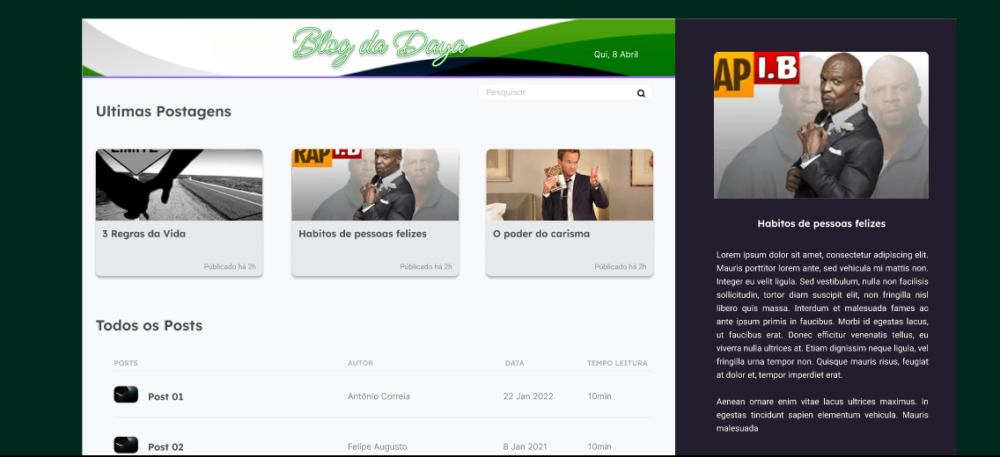

##  <div align="center">🚧 EM CONSTRUÇÃO 🚧</div>
  
#  <div align="center">Blog da Daya</div>
[](./LICENSE)

# Template do Projeto
<a href="https://www.figma.com/file/vXLkg0v7ibiVOVtiyBssFZ/Blog-Dayane?node-id=1%3A3">
 
 </a>
 
 
 # Setup de ambiente:
- Node LTS
- Yarn 1.x
- Next 12.x

# Tecnologias Utilizadas
> eslint

>  Commitzem

>  Husk

>  prettier

>  lint-staged

>  storybook

>  Jest

>  tailwindcss

# Como rodar localmente?
Clone o projeto git clone 

Execute o comando  ```yarn install```

Execute o comando ```yarn dev```

Acesse a pagina http://localhost:3000


 

# Estrutura do projeto
  `/src/pages:` Diretório que o Next.js usa para montar o sistema de roteamento

 `/src/components:` Diretório que contem os componentes de interface.

 `/.husky: ` Scripts utilizado pela ferramenta Husky para executar automaticamente em determinadas fases do commit

 `/.storybook: `  Arquivos de configurações do Storybook

 `/.generators: ` Configurações da biblioteca plop 
 `/.generators/templates: ` Templates utilizado pela ferramenta plop para a geração dos arquivos

  # 📝 License 

Copyright © 2022 [Mairon Vilela](https://github.com/maironvilela).<br />
This project is [MIT](https://github.com/maykbrito/screenboard/blob/master/LICENSE) licensed.